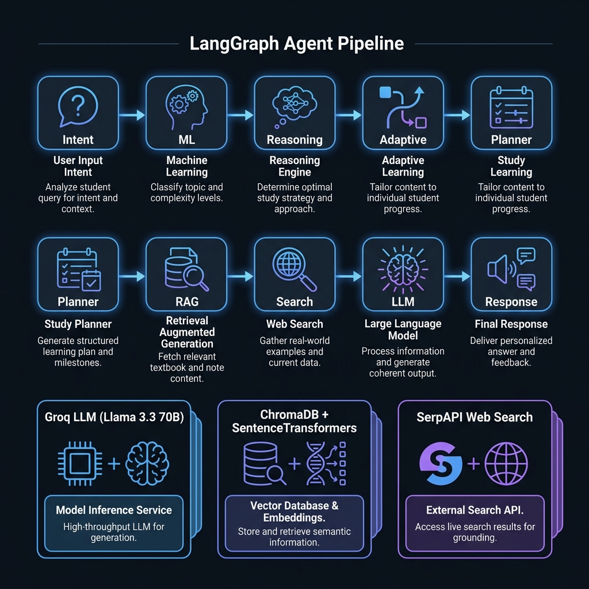

<div align="center">

# StudyAI — Your AI-Powered Study Coach

**An intelligent, multi-agent study coach that analyzes student performance, identifies weaknesses, generates personalized study plans, and recommends curated learning resources — all powered by a 9-node LangGraph agent pipeline.**

[](https://python.org)
[](https://streamlit.io)
[](https://langchain-ai.github.io/langgraph/)
[](https://groq.com)
[](LICENSE)

### [Try the Live Application Here!](https://ai-study-coach-xedbefuukzrmyohydecamk.streamlit.app/)

<br/>

[Features](#-features) · [Architecture](#-architecture) · [Quick Start](#-quick-start) · [Tech Stack](#-tech-stack) · [Project Structure](#-project-structure) · [API Keys](#-api-keys) · [Contributing](#-contributing)

</div>

---

## Features

| Feature | Description |
|---|---|
| **ML Performance Classification** | Scikit-learn models predict Pass/Fail outcomes and cluster students into High Performer, Average, or At Risk categories using quiz scores, engagement, and attendance data |
| **Intelligent Reasoning Engine** | Automatically identifies weak areas (low engagement, poor quiz scores, attendance gaps, inconsistent performance) with contextual explanations |
| **Adaptive Difficulty Scaling** | Dynamically adjusts content difficulty (Easy → Medium → Hard) and detects performance trends (improving / declining / stable) based on student metrics |
| **Personalized Study Plans** | Generates structured, actionable study plans tailored to the student's difficulty level, weak areas, and learning trajectory |
| **RAG-Powered Guidance** | Retrieves relevant study material from a ChromaDB vector store using semantic search (SentenceTransformers), filtered by student cluster and weak areas |
| **Live Resource Search** | Fetches curated video tutorials and courses from the web via SerpAPI, prioritizing inline videos with thumbnails |
| **Conversational AI Coach** | Full chat interface powered by Groq's Llama 3.3 70B — responds like a supportive mentor with memory of past conversations |
| **Analytics Dashboard** | Visual dashboard with metric cards (prediction, cluster, difficulty, trend), weak area tags, study plan breakdown, and clickable resource cards |
| **Premium Dark UI** | Glassmorphism design, gradient accents, micro-animations, and Inter typography — built entirely with custom CSS in Streamlit |

---

## Architecture

StudyAI uses a **9-node LangGraph agent pipeline** where each node performs a specialized task. The nodes execute sequentially, building up a rich state that flows through the entire pipeline:

<div align="center">

</div>

<br/>

```
Intent → ML → Reasoning → Adaptive → Planner → RAG → Search → LLM → Response
```

| Node | Responsibility |
|---|---|
| **Intent** | Classifies user query into `analysis`, `planning`, `resources`, `next_steps`, or `general` |
| **ML** | Runs scikit-learn classifier + clustering on student data → outputs prediction, cluster, metrics |
| **Reasoning** | Analyzes metrics to identify weak areas and generate human-readable reasoning text |
| **Adaptive** | Sets difficulty level and performance trend based on prediction, cluster, and engagement scores |
| **Planner** | Generates a structured study plan customized to difficulty level and identified weak areas |
| **RAG** | Queries ChromaDB vector store with a smart composite query, filters results by cluster type |
| **Search** | Fetches live video tutorials and courses from Google via SerpAPI |
| **LLM** | Sends the full enriched context (metrics + plan + RAG + resources + history) to Groq Llama 3.3 70B |
| **Response** | Passes the final LLM response back to the UI |

### Service Layer

| Service | Technology | Purpose |
|---|---|---|
| **LLM Service** | Groq API + Llama 3.3 70B Versatile | Generates conversational, mentor-style responses |
| **Search Service** | SerpAPI (Google Search) | Retrieves video tutorials and course recommendations |
| **RAG Embedder** | ChromaDB + `all-MiniLM-L6-v2` | Stores and queries embedded study material |
| **ML Tool** | Scikit-learn + Joblib | Performance classification and student clustering |

---

## Quick Start

### Prerequisites

- Python 3.10 or higher
- [Groq API Key](https://console.groq.com/keys) (free tier available)
- [SerpAPI Key](https://serpapi.com/) (free tier: 100 searches/month)

### Installation

```bash
# 1. Clone the repository
git clone https://github.com/YOUR_USERNAME/StudyAI.git
cd StudyAI

# 2. Create and activate a virtual environment
python -m venv venv
source venv/bin/activate        # macOS / Linux
# venv\Scripts\activate         # Windows

# 3. Install dependencies
pip install -r requirements.txt

# 4. Set up environment variables
cp .env.example .env
# Open .env and add your API keys:
#   GROQ_API_KEY=gsk_...
#   SERPAPI_KEY=...

# 5. Build the RAG vector store (one-time setup)
python setup_rag.py

# 6. Launch the application
streamlit run app/app.py
```

The app will open at **http://localhost:8501**.

---

## Tech Stack

<div align="center">

| Layer | Technology |
|---|---|
| **Frontend** | Streamlit + Custom CSS (Glassmorphism, Inter font, dark theme) |
| **Agent Framework** | LangGraph (StateGraph with 9 sequential nodes) |
| **LLM** | Groq Cloud — Llama 3.3 70B Versatile |
| **ML Models** | Scikit-learn (Classifier + KMeans Clustering) |
| **Vector Database** | ChromaDB (persistent, local) |
| **Embeddings** | SentenceTransformers (`all-MiniLM-L6-v2`) |
| **Web Search** | SerpAPI (Google Search API) |
| **State Management** | TypedDict-based AgentState with conversation memory |
| **Serialization** | Joblib (pre-trained model persistence) |

</div>

---

## Project Structure

```
StudyAI/
├── app/
│   ├── app.py                    # Streamlit UI (landing, onboarding, setup, chat, dashboard)
│   └── components/
│       ├── api_key_input.py      # API key input component
│       ├── chat_ui.py            # Chat interface component
│       ├── recommendations.py    # Resource card component
│       └── upload.py             # File upload component
│
├── agent/
│   ├── config.py                 # Environment variable loader
│   ├── graph.py                  # LangGraph pipeline builder (9 nodes)
│   ├── memory.py                 # Conversation history manager
│   ├── state.py                  # AgentState TypedDict definition
│   ├── nodes/
│   │   ├── intent_node.py        # Query intent classifier
│   │   ├── ml_node.py            # ML prediction trigger
│   │   ├── reasoning_node.py     # Weak area & reasoning engine
│   │   ├── adaptive_node.py      # Difficulty & trend calculator
│   │   ├── planner_node.py       # Study plan generator
│   │   ├── rag_node.py           # RAG retrieval + filtering
│   │   ├── search_node.py        # Web search orchestrator
│   │   ├── llm_node.py           # LLM prompt builder + caller
│   │   └── response_node.py      # Final response formatter
│   └── tools/
│       └── ml_tool.py            # Scikit-learn prediction & clustering
│
├── services/
│   ├── llm_service.py            # Groq API wrapper
│   └── search_service.py         # SerpAPI course/video search
│
├── rag/
│   ├── embedder.py               # ChromaDB + SentenceTransformer embedder
│   ├── rag_pipeline.py           # Document loader, splitter, indexer
│   └── documents/
│       └── study_material.txt    # Source study material for RAG
│
├── models/
│   ├── classifier.joblib         # Pre-trained pass/fail classifier
│   ├── cluster_model.joblib      # KMeans clustering model
│   ├── cluster_scaler.joblib     # Cluster feature scaler
│   ├── column_means.joblib       # Feature mean values for imputation
│   ├── feature_columns.joblib    # Expected feature column names
│   ├── scaler.joblib             # Feature scaler for classifier
│   └── time_spent_bounds.joblib  # Outlier bounds for time_spent
│
├── assets/
│   ├── hero_preview.png          # README hero image
│   └── architecture.png          # Architecture diagram
│
├── .streamlit/
│   └── config.toml               # Streamlit theme configuration
│
├── main.py                       # CLI test runner
├── setup_rag.py                  # One-time RAG vector store builder
├── test_ml.py                    # ML model tests
├── test_rag.py                   # RAG pipeline tests
├── test_search.py                # Search service tests
├── requirements.txt              # Python dependencies
├── .env.example                  # API key template
├── .gitignore                    # Git ignore rules
└── README.md                     # This file
```

---

## API Keys

StudyAI requires two API keys. Both offer **free tiers** — no credit card needed.

| Key | Provider | Free Tier | Get It |
|---|---|---|---|
| `GROQ_API_KEY` | Groq | Free (rate-limited) | [console.groq.com/keys](https://console.groq.com/keys) |
| `SERPAPI_KEY` | SerpAPI | 100 searches/month | [serpapi.com](https://serpapi.com/) |

```bash
# .env
GROQ_API_KEY=gsk_your_key_here
SERPAPI_KEY=your_serpapi_key_here
```

> **Note**: You can also enter your Groq API key directly in the app's sidebar at runtime — no `.env` file required for that one.

---

## App Screens

| Screen | Description |
|---|---|
| **Landing** | Hero page with feature cards, CTA button, and tech stack badges |
| **Onboarding** | Name + API key entry with validation |
| **Setup** | Academic data input (quizzes, attendance, time spent, assignments, subject) |
| **Chat** | Full AI chat with conversation memory, powered by the complete 9-node pipeline |
| **Dashboard** | Metric cards, weak areas, AI reasoning, study plan, and clickable video/course resources |

---

## Testing

```bash
# Test ML model predictions
python test_ml.py

# Test RAG pipeline retrieval
python test_rag.py

# Test SerpAPI search service
python test_search.py

# Run the full agent pipeline via CLI
python main.py
```

---

## Contributing

Contributions are welcome! Here's how to get started:

1. **Fork** the repository
2. Create a feature branch: `git checkout -b feature/your-feature`
3. Commit your changes: `git commit -m "Add your feature"`
4. Push to the branch: `git push origin feature/your-feature`
5. Open a **Pull Request**

Please ensure your code follows the existing project structure and includes relevant tests.

---

## License

This project is licensed under the MIT License — see the [LICENSE](LICENSE) file for details.

---

<div align="center">

**Built with ❤️ using LangGraph, Groq, ChromaDB, and Scikit-Learn**

⭐ Star this repo if you found it useful!

</div>
